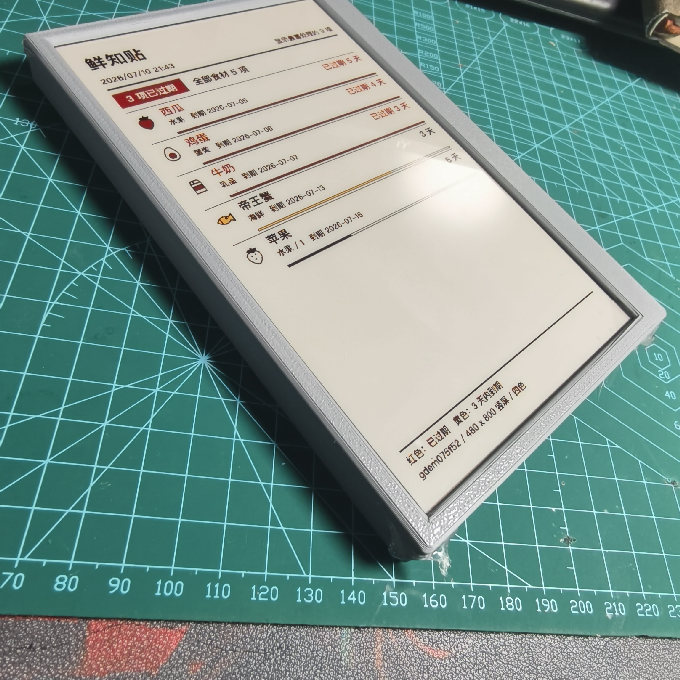

# 鲜知贴

[项目介绍网站](https://xueyou-diy-lab.yummy-tulip-8164.chatgpt.site/) · [在线体验](https://fridge.followllm.online) · [Roadmap](ROADMAP.md)

把家庭物品的存放地点、有效期和到期提醒同步到一块低功耗墨水屏上。食品仍是重点场景，同时支持零食、药品、保健品和日用品。

本仓库提供一套可以复刻的完整方案：浏览器端有效期物品管理、Node.js 服务端、
ESP32-C3 / ESP32-S3 固件、三色 / 四色墨水屏渲染，以及 4.2 寸和 7.2 寸
3D 打印外壳。你可以直接使用我们提供的托管服务，只制作硬件；也可以把服务端
部署在家里的电脑、NAS 或自己的云服务器上。



## 能做什么

- 在手机 H5 中记录物品名称、分类、数量、存放地点和有效期。
- 自动计算到期状态，优先显示已过期和即将到期的物品，并可按名称、分类或地点查找。
- ESP32 定时联网获取新画面，无变化时不重复刷新，随后进入深度睡眠。
- 支持竖屏和横屏，以及 4.2 寸三色、3.97 / 7.5 寸四色墨水屏。
- 可选使用内置助手或 MCP，让 Agent 查询和管理家庭物品；食品可保守推断保鲜期，健康相关物品不会猜测有效期。
- 不同家庭的物品和设备相互隔离；管理员可提供系统 Agent，用户也可配置仅自己使用的 API Key。

## 整体是怎么工作的

```text
手机 / 电脑浏览器
  添加物品、查找地点、查看状态、生成一次性配对码
            │
            ▼
鲜知贴服务端（公共托管 / 本地电脑或 NAS / 自有云服务器）
  保存数据 → 生成适配屏幕的 PNG 和原生二进制帧 → 通过 ETag 判断画面是否变化
            │
            ▼
ESP32-C3 或 ESP32-S3
  定时唤醒 → 连接 Wi-Fi → 下载新帧 → 刷新墨水屏 → 深度睡眠
```

中文排版、图标和颜色转换都在服务端完成，ESP32 只负责配网、下载和刷屏。
因此更换页面布局时通常不需要在单片机上实现字体排版。

## 先选择你的制作方式

| 方式 | 你需要准备 | 服务地址 | 适合谁 |
| --- | --- | --- | --- |
| 使用公共托管服务（推荐入门） | 制作并烧录硬件 | `https://fridge.followllm.online` | 想最快做出成品，不想维护服务器 |
| 局域网本地部署 | 硬件 + 一台常开的电脑或 NAS | 例如 `http://192.168.0.101:8788` | 数据只放家里，接受设备只能在同一网络同步 |
| 自有云服务器部署 | 硬件 + Node.js 服务器 + HTTPS 域名 | 你的 HTTPS 地址 | 需要跨网络同步并完全控制服务 |
| 仅体验软件 | 浏览器即可 | 公共托管或本地 `127.0.0.1` | 先看 H5 和屏幕预览，再决定是否买硬件 |

公共托管服务不是制作硬件的必选项。固件、协议、服务端和数据库都在本仓库中，
三种部署方式使用相同的设备配对和取帧流程。

## 硬件清单

先做一个 USB 供电的桌面原型最简单，确认屏幕能够刷新后再考虑电池、开关和外壳。

### 必需

- 一块开发板（二选一）：
  - `ESP32-C3 Super Mini`：体积小、成本低，无 PSRAM 也能使用本项目的分块刷屏方案。
  - `ESP32-S3 N16R8`：内存更充裕，适合继续扩展。
- 一块已支持的 SPI 墨水屏及匹配的驱动 / 转接板（三选一）：
  - `GDEY042Z98` / `E042A13`：4.2 寸，400 × 300，黑白红三色。
  - `GDEM0397F81`：3.97 寸，800 × 480，黑白黄红四色。
  - `GDEM075F52`：7.5 寸，800 × 480，黑白黄红四色。
- USB 数据线、可靠的 5V USB 供电和连接线。
- 一台可以运行 Arduino IDE 2.x 的电脑。
- 可用的 2.4 GHz Wi-Fi；ESP32 不能连接仅 5 GHz 的网络。

### 可选

- 3D 打印外壳、螺丝和安装辅料。
- 电池、充放电模块和电源开关。不同模块的电气参数差异很大，本仓库外壳中的
  电子件包络不能替代电源设计；第一次调试建议先使用 USB 供电。
- 一台常开的电脑、树莓派或 NAS，用于本地部署服务端。
- 自有域名和 HTTPS 反向代理，用于公网部署。
- OpenAI-compatible 模型 API Key，可由服务管理员统一提供，也可由用户配置自己的 Key；显示物品不需要。

> [!IMPORTANT]
> 屏幕裸板、驱动板和开发板的电压要求可能不同。当前接线表按本项目使用的
> 3.3V SPI 转接板编写；接线前请同时核对你购买的屏幕和转接板资料，不要把
> 5V 逻辑信号直接接到只接受 3.3V 的器件上。

## 从零制作：按这个顺序做

### 第 1 步：先体验页面并决定屏幕

打开 [公共托管服务](https://fridge.followllm.online) 注册账号，添加几条物品，
然后在“设备”页面切换面板和横竖方向查看屏幕预览。这样可以在购买或接线前确认
自己想要 4.2 寸三色还是更大的四色版本。

如果不想使用公共服务，也可以直接跳到[第 3 步](#第-3-步可选在本地运行服务端)。

### 第 2 步：连接 ESP32 和墨水屏

固件同时支持 C3 和 S3，但两块板的引脚不同：

| 墨水屏转接板 | ESP32-C3 Super Mini | ESP32-S3 N16R8 |
| --- | --- | --- |
| `GND` | `GND` | `GND` |
| `3V3` / `VCC` | `3V3` | `3V3` |
| `SCK` / `CLK` | GPIO4 | GPIO12 |
| `SDA` / `DIN` / `MOSI` | GPIO6 | GPIO11 |
| `RST` / `RES` | GPIO5 | GPIO7 |
| `DC` | GPIO3 | GPIO8 |
| `CS1` / `CS` | GPIO7 | GPIO10 |
| `BUSY` | GPIO10 | GPIO9 |
| `CS2`、`MISO` | 不接 | 不接 |

转接板上的 `SDA` 在这里是 SPI `MOSI`，不是 I²C。C3 建议避开 GPIO20 / GPIO21，
并让天线远离屏幕排线和金属外壳。更完整的板卡设置、内存策略和排障日志见
[固件说明](esp32_epaper_fridge_tracker/README.md)。

### 第 3 步（可选）：在本地运行服务端

如果直接使用公共托管服务，可以跳到第 4 步。

本地服务需要 Node.js 22.5 或更高版本：

```sh
cd fridge_tracker_server
npm install
npm run install:browsers
cp config.example.json config.json
npm start
```

浏览器打开 `http://127.0.0.1:8788`。默认只允许本机访问；要让同一 Wi-Fi 下的
ESP32 连接，把 `config.json` 中的 `host` 改为 `0.0.0.0`，替换示例密码和密钥，
再重启服务。

在 Mac 上查询局域网地址：

```sh
ipconfig getifaddr en0
```

如果输出 `192.168.0.101`，设备配网页中的服务地址应填写
`http://192.168.0.101:8788`，不能填写 `127.0.0.1`。Linux、NAS、公网 HTTPS、
数据库和反向代理注意事项见[服务端说明](fridge_tracker_server/README.md)。

### 第 4 步：选择屏幕并烧录固件

用 Arduino IDE 打开
`esp32_epaper_fridge_tracker/esp32_epaper_fridge_tracker.ino`。

1. 在 Arduino IDE 的 Boards Manager 安装 Espressif 的 `esp32` 开发板包；在
   Library Manager 安装 `GxEPD2` 和 `Adafruit GFX Library`。
2. 打开 `esp32_epaper_fridge_tracker/Config.h`，只修改
   `FRIDGE_PANEL_TYPE` 为实际屏幕对应的值。
3. 在 Arduino IDE 的 `Tools → Board` 选择实际开发板，不要手动修改
   `BoardProfile.h`。
4. 使用 `115200` 波特率打开串口监视器，然后编译并上传。

| 实际屏幕 | `FRIDGE_PANEL_TYPE` |
| --- | --- |
| GDEM075F52 | `FRIDGE_PANEL_GDEM075F52` |
| GDEM0397F81 | `FRIDGE_PANEL_GDEM0397F81` |
| GDEY042Z98 / E042A13 | `FRIDGE_PANEL_GDEY042Z98` |

| 开发板 | Arduino IDE Board | 关键设置 |
| --- | --- | --- |
| ESP32-C3 Super Mini | `Nologo ESP32C3 Super Mini` | 4MB Flash；No OTA (2MB APP/2MB FATFS)；USB CDC Enabled |
| ESP32-S3 N16R8 | `ESP32S3 Dev Module` | 16MB Flash；3MB APP / 9.9MB FATFS；OPI PSRAM；USB CDC Enabled |

准确的 Arduino IDE / CLI 命令和依赖以[固件说明](esp32_epaper_fridge_tracker/README.md#arduino-ide-与命令行)为准。

### 第 5 步：生成一次性配对码

在你选择的服务中登录 H5：

- 公共托管：`https://fridge.followllm.online`
- 本地服务：`http://127.0.0.1:8788`

进入“设备”页面，选择与固件一致的屏幕型号和方向，生成一次性配对码。

### 第 6 步：给设备配网并绑定

固件首次启动会创建名为 `XianZhiTie-xxxxxx` 的 Wi-Fi 热点：

1. 用手机连接这个热点。
2. 浏览器打开 `http://192.168.4.1`。
3. 填写家里的 2.4 GHz Wi-Fi 和密码。
4. 填写服务地址：公共托管地址、局域网地址或你的 HTTPS 地址。
5. 填写刚才生成的一次性配对码，选择方向和检查间隔并保存。

设备重启后会向服务注册、下载第一幅画面、刷新屏幕并休眠。已有设备需要重新配置时，
按住 BOOT（GPIO0）复位可清空 NVS 和缓存帧；正常断电再上电也会在本轮画面检查后
临时开放配置热点。

### 第 7 步：确认完整链路

在 H5 添加或修改一条物品，等待设备下次检查，或重新上电触发检查。成功时应看到：

- “设备”页面出现该设备，并显示最近同步时间。
- 串口日志先显示 Wi-Fi 地址和注册成功，再显示 `Stored frame bytes`。
- 4.2 寸三色屏的帧大小为 `30000` 字节；两款四色屏为 `96000` 字节。
- 屏幕显示新物品，随后日志显示屏幕休眠和 ESP32 深度睡眠。
- 物品没有变化时服务返回 `304`，设备不重复刷新，这是正常的省电行为。

如果热点找不到、画面不更新或颜色异常，先按上述顺序判断问题发生在配网、注册、
下载还是刷屏阶段，再查阅[固件日志与排障说明](esp32_epaper_fridge_tracker/README.md#配置入口与运行日志)。

### 第 8 步（可选）：打印外壳并完成装配

- 4.2 寸版本：打开
  [`models/ink_frame_v1/ink_frame_assembly.step`](models/ink_frame_v1/ink_frame_assembly.step)
  查看完整装配，打印文件、参数化源码、实物测量和大模型 CAD 工作流见
  [4.2 寸外壳说明](models/ink_frame_v1/README.md)。
- 7.2 寸版本：可直接用 Bambu Studio 打开
  [`models/epaper_enclosure_7_2/冰箱显示屏.3mf`](models/epaper_enclosure_7_2/冰箱显示屏.3mf)，
  结构、打印参数和 MakerWorld 地址见[7.2 寸外壳说明](models/epaper_enclosure_7_2/README.md)。

不同批次的屏幕、驱动板、电池和接口位置可能变化。把现有外壳作为参考，打印前仍应
用卡尺复测屏幕安装槽、可视窗口、FPC、Type-C、开关和最高电子件位置。

## 部署方式详解

### 使用我们提供的托管服务

公共地址为 `https://fridge.followllm.online`。这里只需要注册账号、生成配对码，
不需要安装 Node.js、数据库或浏览器渲染依赖。不同家庭的数据相互隔离，家庭成员共享同一份物品和设备。

基础物品管理和墨水屏同步不需要配置模型。管理员可在“用户 → 系统 Agent”中提供统一的
API Key、模型 ID 和 Base URL；用户也可在“我的 Agent”中填写个人配置，个人配置优先且不消耗系统额度。
新注册账号默认获得 100 次系统 Agent 文字输入额度，升级时历史账号也会补到至少剩余 100 次；
每个人的额度和对话记录保持独立，管理员可以在用户列表中调整总额度。

### 部署在本地电脑或 NAS

服务和 SQLite 数据全部保存在自己的设备上。ESP32 与服务端通常需要位于同一局域网，
并且运行服务的电脑或 NAS 要在设备定时同步时保持在线。这种方式不要求域名或 HTTPS，
但不要把未加密的本地 HTTP 端口直接暴露到公网。

### 部署在自己的公网服务器

服务端可以运行在支持 Node.js 22.5+ 和 Chromium 的 Linux 主机上。正式部署至少需要：

- 使用独立的 `config.json` 和新的管理员密码、设备 token、凭据加密密钥。
- 持久化 `fridge_tracker_server/data/`，并做好 SQLite 备份。
- 使用 Caddy、Nginx 或托管平台入口提供 HTTPS。
- 确保 Playwright Chromium 及其系统依赖已安装。
- 不要公开本地演示账号、演示 token 或未加密的 MCP HTTP 端点。

更细的配置字段、用户隔离、MCP 和 Agent 说明放在
[服务端 README](fridge_tracker_server/README.md)，主 README 只保留完成硬件所需的路径。

## 仓库目录

| 目录 | 内容 | 从这里继续 |
| --- | --- | --- |
| `fridge_tracker_server/` | H5、API、SQLite、账号、MCP、Agent、三色 / 四色帧渲染 | [服务端 README](fridge_tracker_server/README.md) |
| `esp32_epaper_fridge_tracker/` | C3 / S3 统一固件、配网、注册、取帧、休眠、屏幕驱动 | [固件 README](esp32_epaper_fridge_tracker/README.md) |
| `models/ink_frame_v1/` | 4.2 寸参数化 CAD、STEP、STL、3MF 和设计检查 | [4.2 寸外壳 README](models/ink_frame_v1/README.md) |
| `models/epaper_enclosure_7_2/` | 7.2 寸 STEP 装配、Bambu Studio 3MF 和实物预览 | [7.2 寸外壳 README](models/epaper_enclosure_7_2/README.md) |

## 修改和验证

服务端命令在 `fridge_tracker_server/` 中运行：

```sh
npm run dev
npm run check
npm test
```

修改到期计算、排序、认证、设备归属或帧生成时应补充对应的 `node:test` 测试。
修改 4.2 寸外壳尺寸、配合、开孔或紧固结构后，从仓库根目录运行：

```sh
python models/ink_frame_v1/design_checks.py
```

然后重新导出并检查完整装配、前框和后壳 STEP。详细开发约定见 `AGENTS.md`。

## 许可协议

本仓库使用 [PolyForm Noncommercial License 1.0.0](LICENSE)，适用于仓库中的
服务端代码、固件、文档、CAD 文件和可打印模型。允许个人学习、研究、业余项目以及
其他非商业目的下的使用、修改和分发，但不允许商业使用。如需商业使用，必须事先获得
版权持有者的单独书面授权。

由于限制商业使用，该许可不属于 OSI 定义的开源许可，更准确地说是“源码可用”（source-available）许可。

## 安全提醒

- 不要提交 `fridge_tracker_server/config.json`、`fridge_tracker_server/data/`、`.env*`、
  生成的帧二进制文件或构建产物。
- 对外提供服务时必须替换所有示例密码和 token，并使用 HTTPS。
- 系统或个人模型 API Key 都不应写入仓库；页面会按账号加密保存，用户只能修改自己的个人配置，只有管理员可以修改系统配置。
